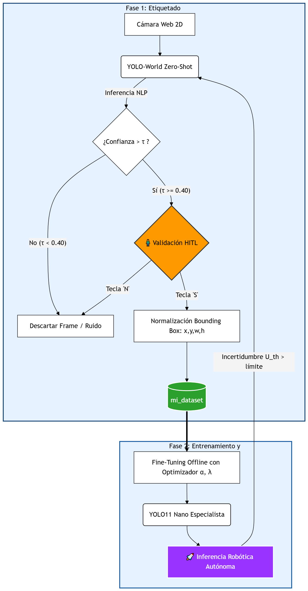
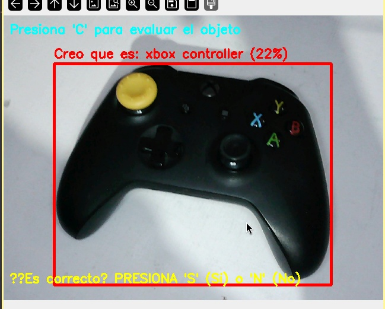
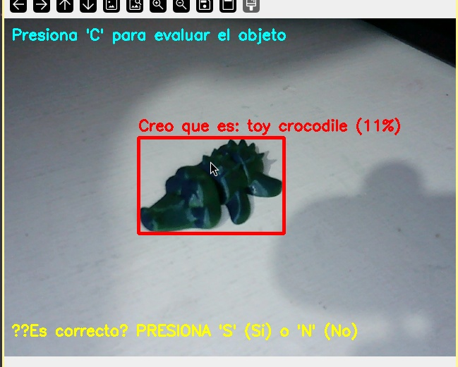
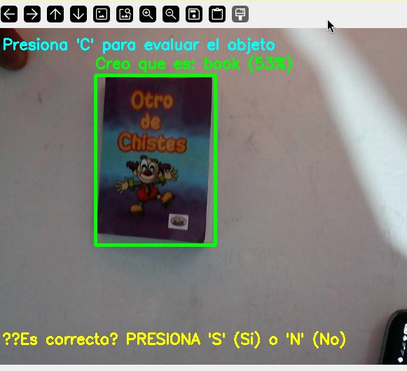
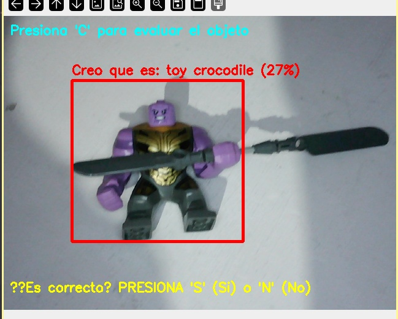
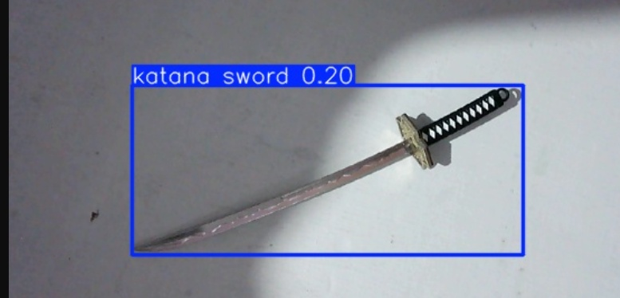
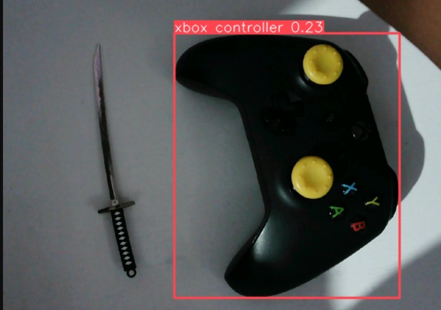

# Sistema de Percepción Semántica Adaptativa asistido por Humanos (HITL) para Agentes Robóticos


Este repositorio contiene la implementación de un sistema de percepción semántica y etiquetado automático asistido por humanos (HITL) utilizando modelos de visión de vocabulario abierto (Zero-Shot). El objetivo de este proyecto es mitigar la extensa carga manual en la creación de conjuntos de datos y dotar a los agentes robóticos de capacidades adaptativas en entornos variables.

## Descripción General

La percepción semántica por sí sola no es suficiente para la manipulación robótica; es el primer paso para el cálculo de *Affordances* (posibilidades de acción). Tradicionalmente, las redes neuronales convolucionales (CNN) se limitan a clases vistas en entrenamiento. Este proyecto rompe esa barrera implementando **YOLO-World**, un modelo que integra Procesamiento de Lenguaje Natural (NLP) a través de la arquitectura CLIP, permitiendo inferir la presencia de objetos atípicos (ej. *toy crocodile*, *katana sword*) basándose únicamente en similitud semántica espacial.

### El Paradigma Human-in-the-Loop (HITL)
El sistema desplaza al operador humano del rol de "creador de datos" al de **"supervisor de decisiones"**. El modelo propone una predicción (Bounding Box + Confianza), y el humano actúa como un filtro binario (`Sí` / `No`), garantizando un dataset final con una precisión del 100% libre de falsos positivos antes del entrenamiento especializado.

## Arquitectura y Metodología

El ecosistema del agente robótico está diseñado en tres fases principales:

1. **Fase 1: Etiquetado Interactivo (Implementado en `ia-video.py`)**
   El sistema captura el entorno mediante una cámara 2D. El modelo Zero-Shot evalúa la escena bajo descripciones de texto y solicita confirmación humana para extraer las coordenadas normalizadas del objeto.

2. **Fase 2: Entrenamiento Offline Especializado (`train_homeobjects.py`)**
   El dataset curado por el humano se utiliza para hacer *fine-tuning* sobre un modelo convolucional ultraligero (ej. YOLO11 Nano). Este modelo especialista reside en la memoria del robot, ejecutando inferencias en milisegundos sin el peso computacional del modelo fundacional original.

### Diagrama de Flujo


## 🔬 Resultados Experimentales y Detección Zero-Shot

Las pruebas en tiempo real demostraron la eficacia de la supervisión HITL. El sistema identificó exitosamente objetos anómalos. Además, la intervención del operador humano previno la degradación del conjunto de datos al descartar anomalías heurísticas (como confundir una figura de acción con un cocodrilo).

### Galería del Bucle HITL en Acción

| Validación Exitosa | Validación Exitosa |
| :---: | :---: |
| <br>*Detección de Xbox Controller (22%) validada por el usuario.* | <br>*Detección de Toy Crocodile (11%) validada por el usuario.* |
| <br>*Detección de Book (53%) validada por el usuario.* | <br>*Falso positivo mitigado: Figura detectada erróneamente como Toy Crocodile (27%) y descartada por el humano.* |

### Inferencia Abierta (Zero-Shot)

|  |  |
| :---: | :---: |
| *Detección de Katana Sword.* | *Evaluación en escenarios con múltiples objetos.* |

## 🚀 Instalación y Uso

**1. Clonar el repositorio e instalar dependencias:**
```bash
git clone [https://github.com/MrChayote/Percepcion-Semantica-de-un-agente-con-HITL.git](https://github.com/MrChayote/Percepcion-Semantica-de-un-agente-con-HITL.git)
cd Percepcion-Semantica-de-un-agente-con-HITL
pip install -r requirements.txt
